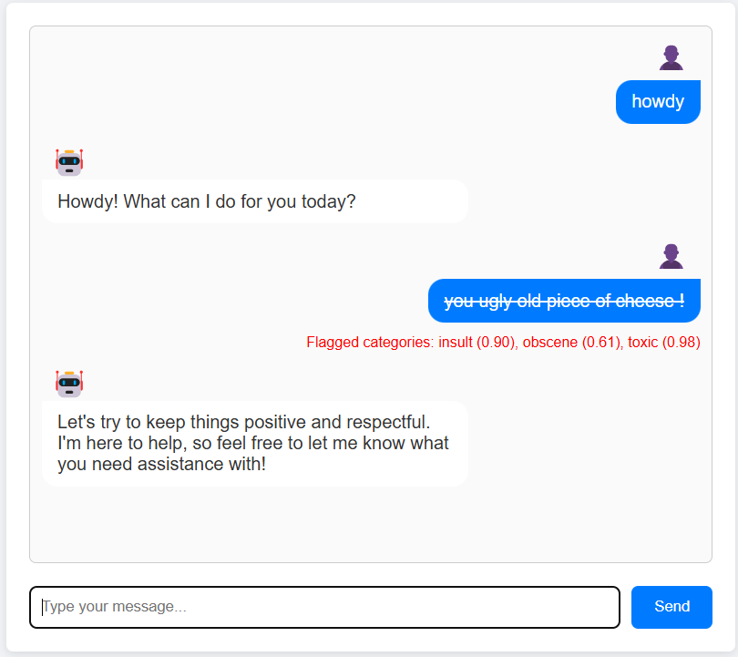

# Chat Moderator | PyTorch, AWS SageMaker
A simple BERT-based model for toxic comment classification, implemented in PyTorch, trained and deployed on SageMaker, with a Flask interface deployed on PythonAnywhere.


⚠️ Be careful that following this project may generate some costs when training and deploying a model on AWS SageMaker. See the [Cleanup and Costs](#cleanup-and-costs) section at the end for more info.

## Project Description

This project implements a content moderation system for a chat application. It leverages a BERT-based model for toxic comment classification (detecting categories such as toxic, obscene, insult, etc.) and uses OpenAI's GPT-4o for generating conversational responses. The model is trained and deployed on [Amazon SageMaker](https://aws.amazon.com/sagemaker/), while the chat interface is served using a Flask web app deployed on [PythonAnywhere](https://www.pythonanywhere.com/). The purpose of this project was to gain valuable knowledge in Cloud solutions.


## Environment Setup
Clone the repository, create a virtual environment and install dependencies as follows. There are multiple requirements files in the repo, use **requirements-project.txt**, which should cover everything  you need.

```bash
https://github.com/alexdjulin/chat-moderator-sagemaker.git
cd chat-moderator-sagemaker
python -m venv venv
source venv/bin/activate  # On Windows: venv\Scripts\activate
pip install -r requirements-project.txt
```

This project has been developed on python 3.12. However, SageMaker uses python 3.8, and pythonanywhere python 3.10, that's why some modules are listed under older versions for compatibility reason in the different requirements files.

## Dataset Download and Review
I trained the model on the [Jigsaw Toxic Comment Classification Challenge](https://www.kaggle.com/c/jigsaw-toxic-comment-classification-challenge/data) dataset, hosted on Kaggle. It consists of user-generated comments from Wikipedia discussions. Each comment is labeled for six types of toxicity:
- toxic
- severe_toxic
- obscene
- threat
- insult
- identity_hate
  
The dataset is structured as a CSV file where each row contains a comment and corresponding binary labels (1 for presence, 0 for absence of a toxicity type). It is meant to train models to classify whether a comment belongs to one or more of these categories. This dataset is widely used for natural language processing (NLP) tasks, particularly for content moderation and text classification, helping to build models that detect harmful language in online discussions, which is exactly what we need.

### Download the Dataset 
You can download the dataset from Kaggle directly or use the **download_dataset.py** script, that will download and unzip it in a **data** folder. You need Kaggle credentials for this, see [Documentation](https://www.kaggle.com/docs/api).
```
python download_dataset.py
```

On success, the script should print the shape, column names and comments distribution.

```
Dataset downloaded successfully. Shape: (159571, 8)

Column names: ['id', 'comment_text', 'toxic', 'severe_toxic', 'obscene', 'threat', 'insult', 'identity_hate']

Sample toxic comments distribution:
toxic            15294
severe_toxic      1595
obscene           8449
threat             478
insult            7877
identity_hate     1405
dtype: int64
```

### Review the Dataset
In the notebooks folder, go through the **dataset_exploration** notebook. It explores the content of the dataset, do a bit of data cleaning and feature engineering and generates two CSV files that can be used for training and testing: **processsed_train.csv** and **processed_val.csv**.


As you can see, the dataset is highly imbalanced, but I did not spend too much time fixing it, as this project was focused on cloud training and deployment.

## Create Model
The **model** folder contains 3 python scripts and 2 requirements files.

### moderator.py
This module defines a BERT-based content moderation model for detecting toxic comments. It classifies text into six toxicity categories using a pre-trained BERT encoder and a classification head. The ContentModerator class provides a predict() method to return toxicity probabilities for given text. The forward() method processes tokenized input through BERT, extracts the CLS token representation, applies a linear classification layer, and outputs probability scores using a sigmoid activation function.

### train.py
This script trains a BERT-based content moderation model on our dataset. It tokenizes text, prepares a PyTorch Dataset and DataLoader, and fine-tunes the ContentModerator model using Binary Cross-Entropy Loss (BCELoss). The model is trained on GPU (if available) and saves its weights to a .pth file. The train_model() function handles data loading, training, and logging, with TensorBoard support for tracking loss trends.

### inference.py
This script handles inference requests for the ContentModerator model in AWS SageMaker. It defines functions for loading the trained model (model_fn), parsing incoming requests (input_fn), running inference (predict_fn), and formatting responses (output_fn). The model is automatically loaded from /opt/ml/model/, and predictions are returned as JSON-formatted toxicity probabilities.

**requirements-train.txt** and **requirements-infer.txt**  
They are packed into the model.tar.gz archive and sent to the S3 bucket respectively during the training and endpoint deployment steps. They list the dependencies specifically required for these steps. They are renamed automatically when used.

## Training on SageMaker
💡 While it would be easy to train a model locally or on Colab, the purpose of this project was to learn how to train and deploy a model using AWS SageMaker.

### AWS Setup
To train and deploy a job on SageMaker, you will need to do the following:
- Create an [AWS account](https://aws.amazon.com/free/) (you can use the free tier to start)
- Create an **S3 bucket** in your region. Mine is called **chat-moderator** and is stored in **eu-central-1**. 
- In your **S3 bucket**, create 3 folders: data, models and output. Upload processed_train.csv and processed_val.csv into the data folder.
- In **IAM**, create a User with AdministratorAccess. You will need its Access Key and password to run inference on the model later (from PythonAnywhre)
- In **IAM**, create a new Role with AmazonS3FullAccess, AmazonSageMakerFullAccess and CloudWatchFullAccess permissions. Copy it's ARN, you will need it for training and inference.
- In **Service Quotas**, SageMaker AWS service, make sure you have at least one **ml.g5.xlarge** GPU for training and endpoint usage for your region. Request one if not.
- Finally install the [AWS CLI](https://aws.amazon.com/cli/) and call 'aws configure' to enter your credentials.

For more information, feel free to check [Andreas Trolle](https://github.com/Andreaswt/ai-video-sentiment-model)'s in-depth tutorial on how to [Train and Deploy a Multimodal AI Model](https://youtu.be/Myo5kizoSk0).

### Create Training Job
Edit **start_sagemaker_training.py** with your bucket name and role ARN, then run it. It will go through the following steps and send a training job to SageMaker using the PyTorch estimator:
- Package train.py, moderator.py and requirements-train.txt into an archive
- Upload it to a new folder in your S3 bucket
- Create the Training Job in SageMaker
- Train and stop automatically once completed or if it runs into an error

I trained my model for 3 epochs, which took about 2.5 hours.

```
python start_sagemaker_training.py
```


The job should be visible in the SageMaker Training Jobs section. Click on it to access its logs in CloudWatch and make sure it is training as expected.


⚠️ I was unable to start a training job simply by using the model.fit() method as shown in the [documentation](https://sagemaker.readthedocs.io/en/stable/api/training/estimators.html#sagemaker.estimator.EstimatorBase.fit). Therefore I had to implement the steps manually using the boto3 AWS SDK module.

### Download trained model


Once the training is done, you can access your model in your S3 bucket, in the output folder. Download and uncompress the model.tar.gz file. It should contain a model.pth model (the trained weights) and a tensorboard folder. Put them both in a model_output folder inside your local model folder.  

If you don't want to go through the training steps, you can download [my model and tensorboard logs](https://alexdjulin.ovh/dev/chat_moderator_sagemaker/model.tar.gz).

You can preview the tensorboard metrics at [this address](http://localhost:6006/) using the following command pointing to your tensorboard folder.
```
tensorboard --logdir=./model/model_output/tensorboard
```


We can see the loss curve improving slightly over the 3 epochs, although the improvement is very minimal.

## Creating Flask App
Now it's time to create our application. 

### Frontend
For the frontend, I asked Claude 3.5 to create a simple chat interface for me. It generated the following 3 files:
- **index.html** in the templates folder
- **css/styles.css** and **js/main.js** in the static folder.

I asked for some modification to get a reactive chat, that would print all messages and then moderate them based on the model's predictions.

### Backend
For the backend, I used Flask to run inference on the model. I hooked it up with a gpt-4o client to generate AI responses and offer a chat experience for testing purposes. I created an **app_local.py** file to run inference on my local model or on a sagemaker endpoint based on input arguments.

The flask endpoint goes through the following steps:
- Configure an OpenAI client using gpt-4o with a conversation context, so the AI assistant keeps track of the discussion
- Load the local model stored in model_output and set it in eval model
- Alternatively run inference on a SageMaker endpoint, to test the deployment done in the next steps
- Run predictions on the model and classify the user's messages
- Send the results to the frontend to display the chat messages with or without moderation, depending on the model's predictions

You can run the Flask chat app like this and access it at http://127.0.0.1:5000.
```python
python app_local.py -m local  # to infer on local model (default)
python app_local.py -m sagemaker  # to infer on sagemaker endpoint
```



As you can see, the second user message has been flagged as insulting and toxic and therefore moderated. For debugging purposes I am just crossing it out and adding any prediction results over the given threshold (0.5) in red below it.

We can use this local app to run tests on our model and re-train it if necessary to achieve better results.

## Deploying Model on SageMaker
Once we have a model we are happy about, we can deploy it as a SageMaker endpoint so we can infer on it from a local or deployed app.

```
python deploy_sagemaker_endpoint.py
```

Running the deployment script will go through the following steps:
- Wrap up the model into a model.tar.gz archive, along the required scripts to run inference on it inside a **code** folder:
```
model.tar.gz  
├── model.pth  
└── code  
    ├── inference.py  
    ├── moderator.py  
    └── requirements.txt  
```
- Upload the archive to the models folder of my S3 bucket
- Delete any existing SageMaker model or endpoint configuration
- Create a SageMaker model
- Create a SageMaker endpoint configuration
- Deploy the endpoint

⚠️ Same issue as for the training step, I was unable to use the model.deploy() method as indicated in the [Documentation](https://sagemaker.readthedocs.io/en/stable/api/inference/model.html) to automate this step and I had to go through these steps manually using the boto3 module.

The endpoint should appear in SageMaker Inference Endpoints and be InService after a short time.


You can use the following script to test the endpoint and infer on the model. You should get the prediction results corresponding to your input text. I set the threshold to 0.5 so it is pretty strict, for testing purposes. If any category has a prediction above this value, the message will be moderated.

```
python infer_on_sagemaker_endpoint.py
```

Alternatively you can test it in the local Flask app too by passing '-m sagemaker' as argument. You should get the same results as when infering on the local model.

```
python app_local.py -m sagemaker
```

## Deploying Flask App on pythonanywhere
This is our final step. Our model is now available in the AWS cloud, but our Flask app is still running locally. We need a simple online service where we can upload and run our app.

For simplicity and to avoid additional costs, I used [pythonanywhere](https://www.pythonanywhere.com) which offers a free tier with 512 MB quota. It's not much but enough to deploy our frontend and backend scripts, as well as create a small environment to infer on the sagemaker endpoint.

Here are the steps I went through for this last step:
- Create a pythonanywhere free account
- Create a new Web App using the manual setup (not Flask)
- In the **Files** tab, upload the **app_deployed.py** and **requirements-app.txt** files, as well as the **static** and **templates** folders.
- Uploaded an **.env** file too, where you specified your OPENAI_API_KEY, as well as the 3 AWS environment variables needed to run inference. See **.env-template**.
  


- In the **Consoles** tab, open a bash console, create a virtual environment and install the dependencies from requirements-app.txt. See [Environment Setup](#environment-setup) section on how to do this.
- In the Web tab, edit the WSGI configuration file as follows to point to your Flask app:
```python
import sys

# Add your project folder to the Python path
project_home = '/home/alexdjulin/chat_moderator'
if project_home not in sys.path:
    sys.path.append(project_home)

# Import Flask app
from app_deployed import app as application
```
- In **Virtualenv**, specify the path to the virtual environment you just created
- Force HTTPS and add a password to access the app if needed

Reload the app, which should now be accessible at your account address, like mine:  
https://alexdjulin.pythonanywhere.com/ (password protected).

You should see the chat interface and be able to interact with the AI Assistant. If infering on the SageMaker endpoint does not work, an [uncensored] tag will be added next to the user's messages.

If you encounter any issue, check the Error log in the **Web** tab.


## Cleanup and costs

Be careful of the resulting costs when using cloud services!

**SageMaker training** fees apply during the training step only, so you won't be charged once the job has completed or failed. Overall my latest model trained for 2.5 hours and cost me $5.

Make sure you delete your **SageMaker endpoint** when you don't need it anymore, as deployment costs about $1.5 per hour of uptime.

**S3 bucket** storage is very cheap, but feel free to delete your bucket once you are done working on the project. It’s easy to create a new one when required.

**IAM users** and **roles** as well as GPU quota requests are free.

Hosting your app on **pythonanywhere** is free when using a Beginner account. Your are limited to 512 MiB storage and your app is running for 3 months. You will need to reload it after this time to keep it available.

## Conclusion

This project demonstrates how to build a scalable and efficient chat moderation system by integrating a BERT-based model trained on a public dataset for toxicity detection. 

By leveraging Amazon SageMaker, the computationally intensive training and inference tasks are offloaded to AWS GPUs, ensuring optimized performance. Meanwhile, deploying the Flask app on PythonAnywhere provides a lightweight and accessible web interface, making the system easy to interact with. 

This architecture effectively scales while maintaining a clear separation between content moderation and conversational AI.

A more streamlined approach could involve fully relying on an LLM to both generate responses and moderate user input simultaneously. This would likely improve classification accuracy and require minimal or even zero-shot learning. However, the current approach offers a local model inference option, which can be advantageous for privacy-focused applications where external API calls might not be desirable.


